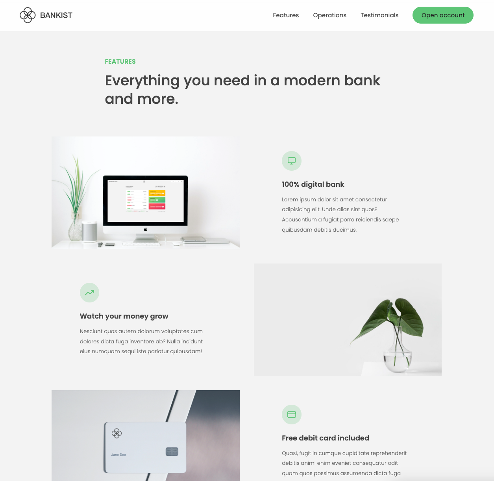

## Website | Bankist

-   This project is an extension of the prior endeavor, app-bankist, which I developed by synthesizing the insights gained from a series of educational courses. The objective herein was to craft an application that emulates an authentic user experience within the realm of banking systems.

## Features

-   Smooth scrooling
-   Event delegation
-   Lazy loading for performance
-   Separate callback from options
-   Animations

## Tech Stack

**Client:** CSS, JavaScript

**Server:** #

## Preview

## Run Locally

-   Fork/clone the project from GitHub and start using it right away with Live Server extenstion.

## Contributing

Contributions are always welcome!

Please adhere to this project's `code of conduct`.

## 🔗 Links

